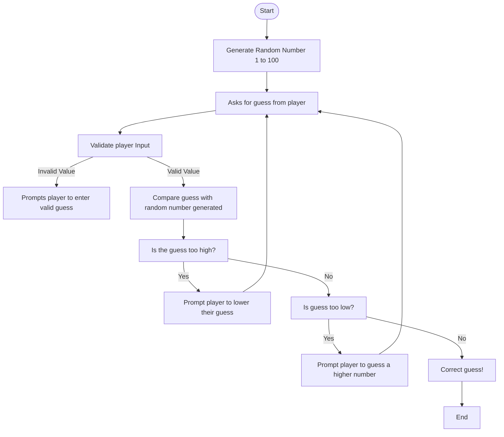

## Guessing Flow chart

## Textual Descriptions: 
1. Game generates a random number from 1 to 100. 
2. Game asks for guess from player. 
3. Game checks player input, is it a valid guess? 
4. If a valid integer, game will check if guess is too high or low. 
5. If guess is incorrect, game will prompt another guess from the player.
6. If guess is correct, game displays that the player wins. 
7. Game ends. 
